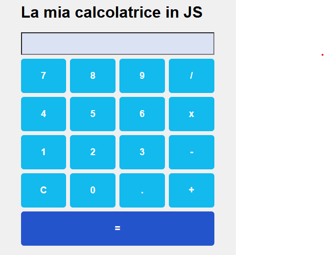

# 🧮 Calcolatrice in JavaScript

Una semplice calcolatrice sviluppata con **HTML**, **CSS** e **JavaScript** , pensata per esercitarmi con la manipolazione del DOM e l'organizzazione del codice client-side.

## 🚀 Funzionalità

- Operazioni base: addizione, sottrazione, moltiplicazione e divisione.
- Interfaccia utente responsive.
- Pulsante per cancellare l'input (`C`).
- Calcolo del risultato con il pulsante `=`.
- Layout ordinato tramite **CSS Grid**.
- Input protetto contro scrittura manuale diretta (`readonly`).

## 🖼️ Screenshot



## 📁 Struttura del progetto

calculator/
├── index.html # Struttura della calcolatrice
├── style.css # Stili personalizzati
├── script.js # Logica di interazione
└── README.md # Documentazione del progetto

## 🧑‍💻 Tecnologie utilizzate

- **HTML5**: per la struttura semantica dell'app.
- **CSS3**: per il layout e la resa grafica dei pulsanti.
- **JavaScript (vanilla)**: per la logica di calcolo e l'interazione utente.

## ✅ Come usarla

1. Clona il repository:

   ```bash
   git clone https://github.com/nellocas01/U1-fs0123-Casolla-Aniello/tree/master/m1/s2/g5
   ```

2. Apri il file index.html nel browser:

cd [nome-repo](https://github.com/nellocas01/U1-fs0123-Casolla-Aniello/tree/master/m1/s2/g5)
open index.html 
# oppure doppio clic da file manager

3. Inizia a utilizzare la calcolatrice!

🔒 Sicurezza
La funzione di calcolo utilizza il costruttore Function() al posto di eval() per migliorare la sicurezza e gestire meglio eventuali errori sintattici.

👨‍💻 Autore
Realizzato da Aniello Casolla – 10/02/2023.

📌 Note
Questo progetto fa parte del mio percorso di apprendimento ed è stato creato per esercitarmi con JavaScript vanilla e DOM manipulation. Qualsiasi feedback è benvenuto!
